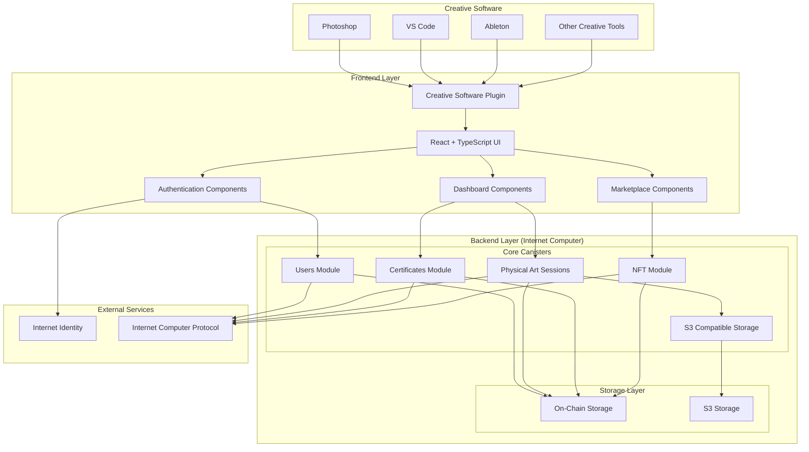
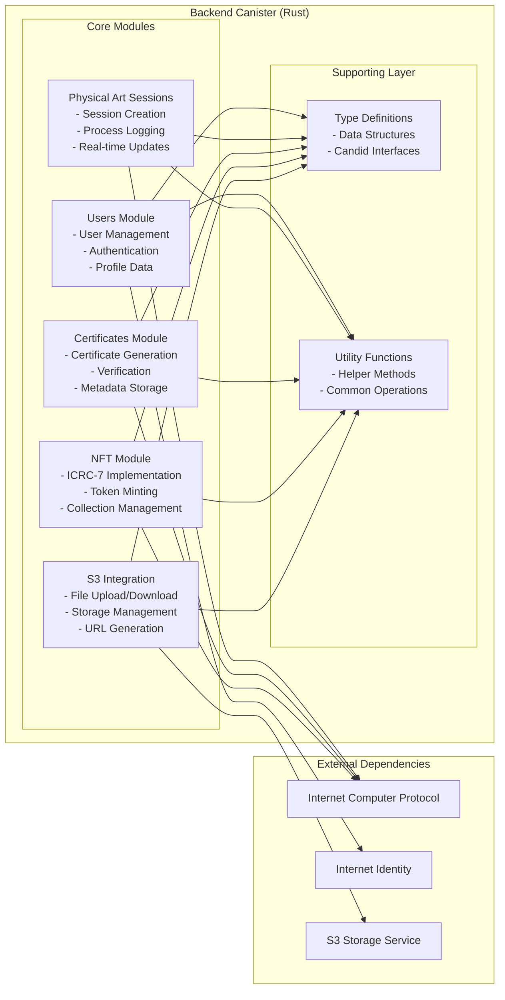
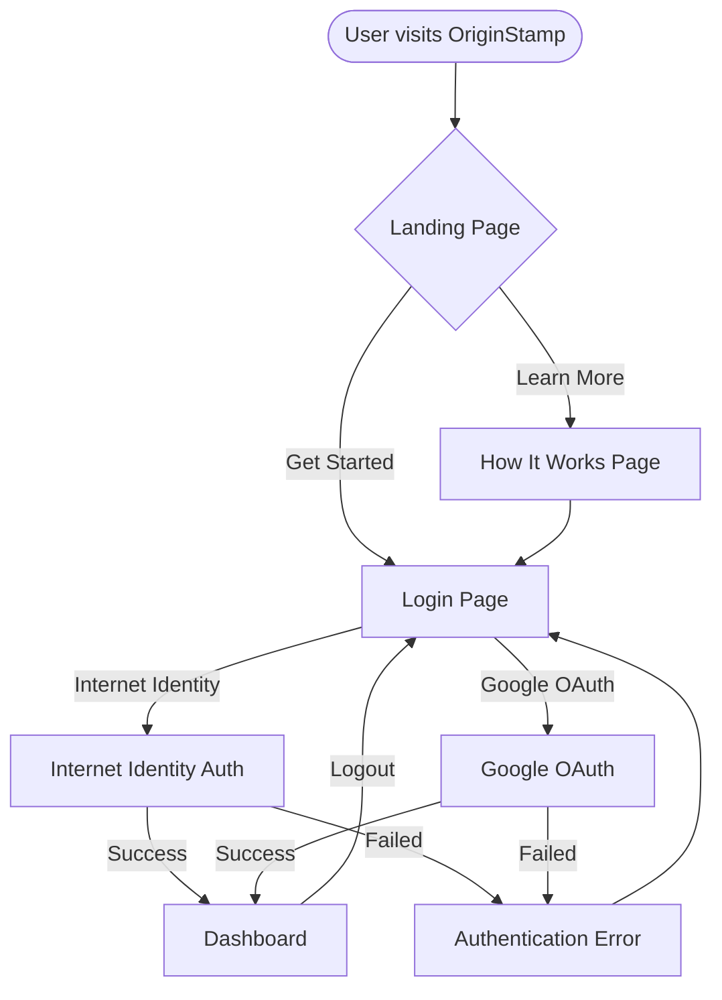
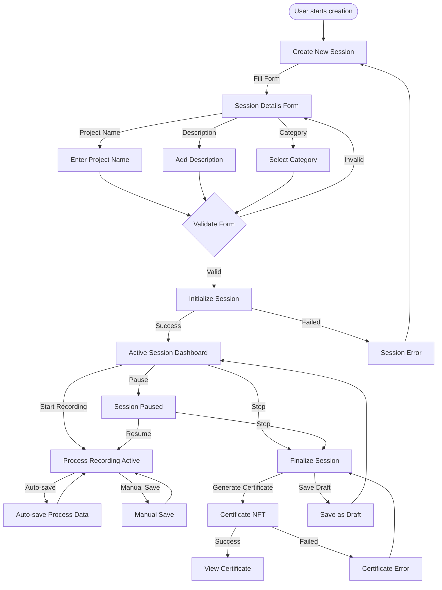
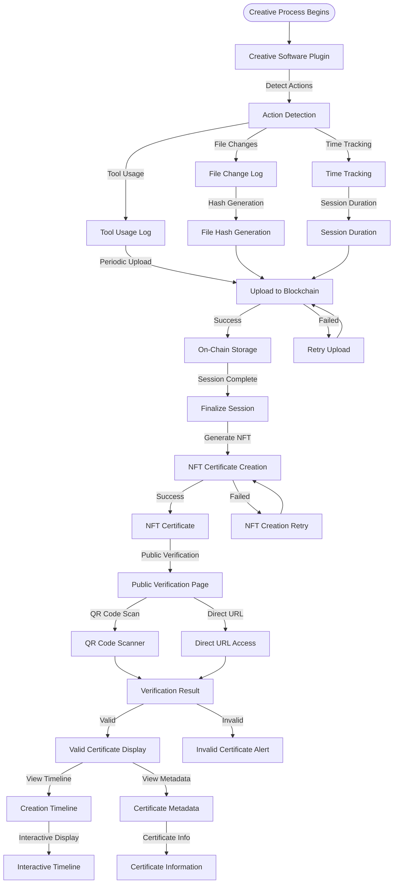
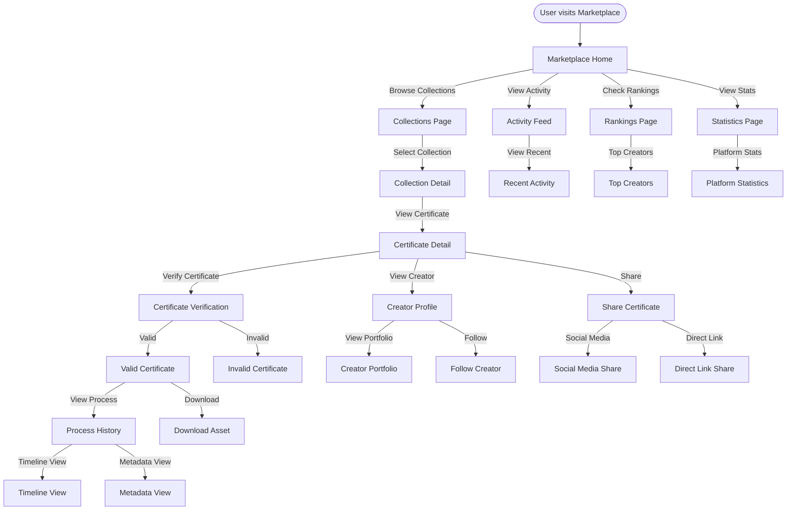
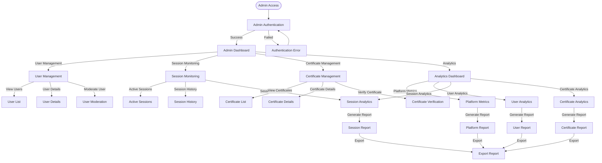

# OriginStamp: Verifying Creation, Elevating Value

> Building the foundational trust layer for the new creative economy. As generative AI blurs the line between human and machine, OriginStamp provides a "Proof-of-Process" protocol, allowing creators to generate unforgeable on-chain histories for their work.

## 🎯 Project Overview

OriginStamp is a revolutionary decentralized protocol that addresses the fundamental crisis of trust in the digital creative economy. In an age where AI-generated content blurs the line between human and machine creation, OriginStamp provides a "Proof-of-Process" protocol that allows creators to generate unforgeable, on-chain histories for their work.

## 🚨 The Problem: The Digital Authenticity Crisis

In the age of advanced generative AI, the digital world faces a fundamental crisis of trust:

- **Indistinguishable Content**: It's becoming increasingly difficult to distinguish authentic, human-created work from AI-generated content
- **Devalued Human Creativity**: The flood of AI content devalues the skill, time, and creativity of human artists, writers, and developers
- **Provenance Issues**: Significant challenges for copyright, digital commerce, and intellectual property protection
- **Lack of Standards**: No reliable standard for verifying the true origin and effort behind digital assets

## 💡 Our Solution: A Paradigm Shift

OriginStamp is **not** an AI detection tool. Instead, we offer a more fundamental and proactive solution: a decentralized protocol for **Proof of Human Process**.

We provide creators with tools to generate an unforgeable, on-chain certificate of origin for any digital or physical work. This certificate doesn't just point to the final file; it contains the entire, immutable history of its creation process.

## 🔧 How It Works: The Three Pillars of Trust

### 1. Verified Identity & Session Initiation

A creator begins by authenticating using **Internet Identity**, linking their secure, hardware-based identity to a new project. They initiate a "Creation Session" within the OriginStamp dApp, which creates a dedicated, secure on-chain log for their work.

### 2. Immutable Process Logging

Through a simple plugin in their native creative software (e.g., Photoshop, VS Code, Ableton), key creative actions are automatically and periodically recorded to the project's on-chain log. These records can include metadata like "New layer created," "Brush tool used," periodic file hashes, or code commit hashes, each with an immutable timestamp.

### 3. The Certificate NFT

Upon completion, the creator finalizes the session. This action mints a final **Certificate NFT**. This NFT is a container holding the final asset's hash and, most importantly, a cryptographic link to the entire, unchangeable on-chain log of its creation process.

## 🔍 The Verification Experience

Anyone can verify an OriginStamp asset. By scanning a QR code or visiting a public verification page, a user is presented with a clear, interactive dashboard. This dashboard displays the full creation timeline, allowing a potential buyer or collector to see the entire history and compare the on-chain process data with the final work, providing unparalleled confidence in its authenticity.

## 🌐 Why Internet Computer (ICP)?

This project is uniquely suited for the Internet Computer ecosystem for several critical reasons:

- **Reverse Gas Model**: This is essential. It allows the platform to cover the small, frequent transaction costs of logging, providing a frictionless experience for creators. They can focus on creating, not on paying for every recorded action.
- **On-Chain Data Storage**: ICP's architecture allows for the efficient and affordable storage of the extensive log data directly on-chain, ensuring the provenance record is truly permanent and decentralized.
- **Internet Identity**: Provides a built-in, secure, and user-friendly authentication system without the need for traditional seed phrases, which is crucial for linking a work to a real identity.
- **Performance**: ICP's speed and fast finality are necessary to handle the real-time logging of creative actions without interrupting the creator's flow.

## 🎯 Hackathon Goal (MVP)

Our goal for the WCHL 2025 hackathon is to build a functional Minimum Viable Product that includes:

- The core canisters for project initiation and immutable logging.
- A proof-of-concept plugin for a web-based text editor.
- The public-facing verification dashboard to display the on-chain process history.

## 🚀 Technology Stack

This project is built with:

- 🦀 **Rust-based Canister** backend
- ⚛️ **React + TypeScript** frontend with modular architecture
- 🎨 **Neumorphic Design System** for modern UI/UX
- 🔐 **Internet Identity** authentication
- 🧪 **Full Test Suite**: Vitest + PocketIC for backend and frontend
- 🔁 **CI/CD** with GitHub Actions for automated tests and code quality
- 📚 **Comprehensive Documentation** for all components

---

## 🏗️ System Architecture

### High-Level Architecture Diagram



### Backend Module Architecture



### Frontend Architecture

```mermaid
graph TB
    subgraph "Frontend Application (React + TypeScript)"
        subgraph "Page Layer"
            Landing[Landing Page]
            Auth[Authentication Pages]
            Dashboard[Dashboard Pages]
            Marketplace[Marketplace Pages]
            Settings[Settings Page]
        end

        subgraph "Component Layer"
            Common[Common Components<br/>- Button, Card, Modal<br/>- Form Elements, Toast]
            
            Layout[Layout Components<br/>- Header, Sidebar<br/>- Navigation, Footer]
            
            Feature[Feature Components<br/>- Session Management<br/>- Certificate Display<br/>- NFT Gallery]
        end

        subgraph "Service Layer"
            AuthService[Authentication Service]
            SessionService[Session Service]
            CertificateService[Certificate Service]
            NFTService[NFT Service]
            S3Service[S3 Service]
        end

        subgraph "State Management"
            AuthContext[Auth Context]
            ToastContext[Toast Context]
            ThemeContext[Theme Context]
        end

        subgraph "Utilities"
            Hooks[Custom Hooks]
            Utils[Utility Functions]
            Types[TypeScript Types]
        end
    end

    subgraph "External Integrations"
        Backend[Backend Canister]
        II[Internet Identity]
        S3[S3 Storage]
    end

    %% Page connections
    Landing --> Common
    Auth --> Common
    Dashboard --> Common
    Marketplace --> Common
    Settings --> Common

    %% Component connections
    Common --> Layout
    Feature --> Common

    %% Service connections
    Auth --> AuthService
    Dashboard --> SessionService
    Dashboard --> CertificateService
    Marketplace --> NFTService
    Settings --> S3Service

    %% Context connections
    AuthService --> AuthContext
    SessionService --> ToastContext
    CertificateService --> ToastContext
    NFTService --> ToastContext

    %% Utility connections
    AuthService --> Hooks
    SessionService --> Hooks
    CertificateService --> Hooks
    NFTService --> Hooks

    %% External connections
    AuthService --> II
    SessionService --> Backend
    CertificateService --> Backend
    NFTService --> Backend
    S3Service --> S3
```



---

## 🔄 User Flow Diagrams

### 1. User Registration & Authentication Flow



### 2. Creation Session Flow



### 3. Process Logging & Verification Flow



### 4. Marketplace & Discovery Flow



### 5. Admin & Analytics Flow



---

## 📜 Table of Contents

- [🎯 Project Overview](#-project-overview)
- [🚨 The Problem](#-the-problem-the-digital-authenticity-crisis)
- [💡 Our Solution](#-our-solution-a-paradigm-shift)
- [🔧 How It Works](#-how-it-works-the-three-pillars-of-trust)
- [🔍 The Verification Experience](#-the-verification-experience)
- [🌐 Why Internet Computer](#-why-internet-computer-icp)
- [🎯 Hackathon Goal](#-hackathon-goal-mvp)
- [🚀 Technology Stack](#-technology-stack)
- [🏗️ System Architecture](#️-system-architecture)
  - [High-Level Architecture Diagram](#high-level-architecture-diagram)
  - [Backend Module Architecture](#backend-module-architecture)
  - [Frontend Architecture](#frontend-architecture)
- [🔄 User Flow Diagrams](#-user-flow-diagrams)
  - [User Registration & Authentication Flow](#1-user-registration--authentication-flow)
  - [Creation Session Flow](#2-creation-session-flow)
  - [Process Logging & Verification Flow](#3-process-logging--verification-flow)
  - [Marketplace & Discovery Flow](#4-marketplace--discovery-flow)
  - [Admin & Analytics Flow](#5-admin--analytics-flow)
- [🚀 Getting Started](#-getting-started)
- [📁 Project Structure](#-project-structure)
- [✅ Testing Patterns](#-testing-patterns)
- [🔄 CI/CD Workflow](#-cicd-workflow)
- [🔗 Resources & Documentation](#-learning-resources)

---

## 🚀 Getting Started

### 🧑‍💻 1. Development Environment Setup

A **devcontainer** is preconfigured for you to start coding instantly!

- Click on "Use this Template" → "Create a new repository".
- Click "Code → Open with Codespaces"
- Change machine type to 4-core 16GB RAM • 32GB
- Once the codespace is created, you can open it in VS Code Local
- Everything is pre-installed and ready for you to run the following commands

### 2. Install Dependencies

```bash
npm install
```

### 3. Configure S3 Storage

OriginStamp requires S3 storage for handling file uploads and storage. Follow these steps to configure S3:

#### Create Environment File

Copy the example environment file and configure your S3 credentials:

```bash
cp .env.example .env
```

Edit the `.env` file and replace the placeholder values with your actual S3 credentials:

```bash
# S3 Configuration for Development
# Replace with your actual S3/AWS credentials
S3_ACCESS_KEY=your_actual_access_key
S3_SECRET_KEY=your_actual_secret_key
S3_REGION=ap-southeast-1
S3_ENDPOINT=https://your-s3-endpoint.com/  # Optional: for S3-compatible services
S3_BUCKET_NAME=your_bucket_name
```

#### Required S3 Environment Variables

- `S3_ACCESS_KEY`: Your AWS/S3 access key
- `S3_SECRET_KEY`: Your AWS/S3 secret key
- `S3_REGION`: AWS/S3 region (e.g., `ap-southeast-1`, `us-west-2`)
- `S3_BUCKET_NAME`: Your S3 bucket name

#### Optional S3 Environment Variables

- `S3_ENDPOINT`: Custom S3 endpoint for S3-compatible services (leave empty for AWS S3)

#### Apply S3 Configuration

After deploying the backend canister, run the S3 setup script to configure the canister:

```bash
# For local development
./scripts/setup-s3.sh local

# For IC mainnet deployment
./scripts/setup-s3.sh ic
```

The script will:

- ✅ Validate your S3 credentials in the `.env` file
- ✅ Configure the backend canister with S3 settings
- ✅ Test the S3 configuration by generating an upload URL
- ✅ Verify that the configuration is working properly

### 4. Start Local Development

#### Option A: Quick Development (Recommended)

```bash
# Start everything for development (DFX + Backend + Frontend)
npm run dev
```

#### Option B: Full Deployment (Production-like)

```bash
# Deploy everything (backend + frontend)
npm run deploy
```

#### Option C: Step-by-Step Deployment

```bash
# Start DFX local network
dfx start --clean

# In another terminal, deploy backend canisters
npm run deploy:backend

# Deploy frontend
npm run deploy:frontend
```

### 5. Development Workflow

```bash
# For daily development (starts DFX, deploys backend, starts frontend)
npm run dev

# After backend deployment, configure S3 (one-time setup)
./scripts/setup-s3.sh local

# For frontend development only (if backend is already running)
npm start
```

**Note**: The S3 configuration script (`./scripts/setup-s3.sh`) should be run after the backend canister is deployed. It's a one-time setup unless you change your S3 credentials or redeploy the backend canister.

### 6. Run Tests

```bash
# Run all tests
npm test

# Run specific test suites
npm run test:frontend    # Frontend tests only
npm run test:backend     # Backend tests only
```

## 📚 Documentation

Comprehensive documentation is available in the `docs/` folder:

- [📖 Project Overview](./docs/project-overview.md) - High-level project description
- [🎨 UI Components](./docs/frontend/ui-components.md) - Design system and components
- [🛠️ Development Setup](./docs/development/development-setup.md) - Development environment guide

---

## 📁 Project Structure

```
OriginStamp/
├── .devcontainer/devcontainer.json       # Container config for development
├── .github/workflows/                    # GitHub CI/CD pipelines
├── docs/                                 # 📚 Comprehensive documentation
│   ├── project-overview.md              # Project description and goals
│   ├── frontend/                        # Frontend component documentation
│   ├── backend/                         # Backend architecture docs
│   ├── testing/                         # Testing strategies and guides
│   ├── development/                     # Development setup and processes
│   └── api/                             # API documentation
├── src/
│   ├── backend/                         # 🦀 Rust backend canister
│   │   ├── src/
│   │   │   └── lib.rs                   # Main Rust file
│   │   └── Cargo.toml                   # Rust dependencies
│   ├── frontend/                        # ⚛️ React + TypeScript frontend
│   │   ├── src/
│   │   │   ├── App.tsx                  # Main App component
│   │   │   ├── pages/                   # 📄 Page components (modular)
│   │   │   │   ├── landing/            # Landing page
│   │   │   │   ├── auth/               # Authentication pages
│   │   │   │   └── dashboard/          # Dashboard pages
│   │   │   ├── components/             # 🧩 Reusable UI components
│   │   │   │   ├── login/              # Authentication components
│   │   │   │   ├── profile/            # User profile components
│   │   │   │   ├── common/             # Common UI elements
│   │   │   │   └── ui/                 # UI components
│   │   │   ├── contexts/               # React contexts
│   │   │   ├── hooks/                  # Custom React hooks
│   │   │   ├── services/               # API service layers
│   │   │   ├── types/                  # TypeScript type definitions
│   │   │   ├── utils/                  # Utility functions
│   │   │   └── css/                    # 🎨 ITCSS styling architecture
│   │   ├── assets/                     # Static assets (images, icons)
│   │   ├── tests/                      # Frontend unit tests
│   │   ├── index.html                  # Frontend entry point
│   │   ├── main.tsx                    # React main file
│   │   ├── package.json                # Frontend dependencies
│   │   ├── tsconfig.json               # TypeScript configuration
│   │   ├── vite.config.ts              # Vite build configuration
│   │   └── vite-env.d.ts               # Vite type definitions
│   └── declarations/                   # Auto-generated canister interfaces
├── tests/
│   ├── src/                            # Backend test files
│   ├── backend-test-setup.ts           # PocketIC instance
│   └── vitest.config.ts                # Vitest configuration
├── scripts/
│   ├── start.sh                        # 🚀 Full deployment script
│   ├── dev-container-setup.sh          # Development environment setup
│   └── generate-candid.sh              # Candid generation script
├── dfx.json                            # ICP configuration
├── Cargo.toml                          # Root Rust workspace config
├── package.json                        # Project dependencies and scripts
└── CHANGELOG.md                        # Project changelog
```

---

## 🔄 CI/CD Workflow

Located under `.github/workflows/`, this includes:

- 🧪 Automated end-2-end test runs
- 🔍 Code quality checks
- 🚀 Automated deployment

## 🧪 Testing Strategy

### Frontend Testing

- **Component Testing**: Individual component tests with React Testing Library
- **Integration Testing**: User flow and interaction tests
- **E2E Testing**: Complete user journey testing

### Backend Testing

- **Unit Testing**: Individual function and method tests
- **Integration Testing**: Canister interaction tests
- **PocketIC Testing**: Local blockchain simulation

## 🎨 Design System

### Neumorphic Design

- **Soft UI**: Subtle shadows and highlights
- **Consistent Spacing**: 8px grid system
- **Color Palette**: Light/dark theme support
- **Typography**: Clear hierarchy and readability

### Component Library

- **Reusable Components**: Button, Card, Modal, Toast
- **Form Elements**: Input, Select, Checkbox
- **Navigation**: Header, Sidebar, Breadcrumbs
- **Feedback**: Loading, Error, Success states

## 🚀 Deployment

### Local Development

```bash
# Full deployment
npm run deploy

# Step-by-step
npm run deploy:backend
npm run deploy:frontend
```

### Production Deployment

- **Internet Computer**: Mainnet deployment
- **Environment Variables**: Secure configuration
- **Monitoring**: Performance and error tracking

## 📚 Learning Resources

- [ICP Dev Docs](https://internetcomputer.org/docs)
- [Rust CDK](https://internetcomputer.org/docs/current/developer-docs/backend/rust/)
- [React Documentation](https://react.dev/)
- [TypeScript Handbook](https://www.typescriptlang.org/docs/)
- [Vite Build Tool](https://vitejs.dev/)
- [Vitest Testing Framework](https://vitest.dev/)

## 🙏 Acknowledgments

- **Internet Computer Foundation** for the amazing blockchain platform
- **React Team** for the incredible frontend framework
- **Rust Community** for the robust backend language
- **Open Source Contributors** who make this possible

---

**Build the future of digital authenticity with OriginStamp! 🚀✨**
